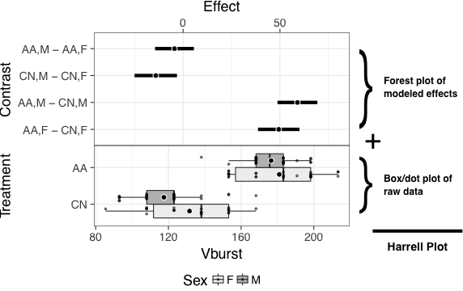

# What this app does

[A working paper on Harrell plots as alternatives to bar, dot, and box plots is at bioRxiv](https://www.biorxiv.org/content/early/2018/11/10/458182) (control- or right click to open in new tab)

[A github R package is available](https://github.com/middleprofessor/harrellplot) (control- or right click to open in new tab)

[A shiny app is available](https://middleprofessor.shinyapps.io/HarrellPlot/) (control- or right click to open in new tab)

The HarrellPlot app creates alternatives to the ubiquitious bar plot. The alternative is a Harrell plot, which combines, a forest plot of modeled coefficients or treatment contrasts with confidence intervals, a dot plot of raw data, and a box plot. Or, the output can be limited to the forest plot of treatment effects, or the the box/dot plots, or just the box plot. The output is pretty flexible. What it doesn't output is a bar plot.

The Harrell plot can be saved as a PDF or the two components (the forest plot of modeled effects and the box/dot plot of the raw data) can be saved as ggplot objects that can be furthered maniupulated in R (HarrellPlot uses the cowplot package to put the two parts together into a single plot object).

Because the HarrellPlot app can output the modeled effects of slightly sophisticated linear models (for example multi-level models with random slopes and intercepts or fixed-effects models with nuissance covariates) the app can also be used for simple modeling, although this is not its strength. Regardless, to facilitate using HarrellPlot for simple modeling, the app outputs several important tables resulting from the modeling underlying the Harrell plot.

# Why a Harrell Plot?
Recommended best practices for the reporting of statistical results include 1) showing the raw data and/or distribution of data in plots and focusing on 2) effect size and 3) uncertainty in effect estimates instead of *p*-values of null hypothesis tests. By contrast, standard practice throughout experimental biology includes the reporting of ANOVA results in tables and treatment means and standard errors in plots. At best, ANOVA tables poorly communicate effect size and uncertainty. Effects and uncertainty can be inferred from plots of treatment means and standard errors only indirectly.

The Harrell plot addresses all three recommended practices by combining into a single plot a forest plot of modeled treatment effects and a box plot with superimposed jittered dots to show the distribution of data within groups. The illustrated effects in the forest plot part can be the coefficients of the linear model or contrasts between treatment combinations. If contrasts, these can be comparisons with a reference (such as a control) or pairwise comparisons.

The raw data are shown in the lower part of the plot using jittered dots, clustered by group. The distribution of data in each group is also shown in the lower part of the plot using a box plot. The precise tool to show the data and distributions is flexible but jittered dots and box plot reflect the best practice for much of experimental biology. While some advocate the use of an error bar, the box plot is more informative than an interval based on the sample standard deviation (including the sample confidence interval). And, an interval based on the standard error of the mean (including a 95% confidence interval of the mean) is typically not the uncertainty that we want to communicate.

# Using the HarrellPlot App
## Data tab -- Importing data
### Choose File button
HarrellPlot imports both tab-delimited (.txt) and comma-separated (.csv) files. The files should have a header row of column labels. The files cannot have leading, commented (#) rows.

Factor levels are automatically ordered in the order that they first appear in a column. To re-order factor levels, it is easiest to sort prior to importing into HarrellPlot.

### Sample data
Upon opening, HarrellPlot loads a dataset from a long term selection experiment on *Drosophila melanogaster* (Weber, K.E., 1996. Large genetic change at small fitness cost in large populations of *Drosophila melanogaster* selected for wind tunnel flight: rethinking fitness surfaces. Genetics, 144(1), pp.205-213.) The response variable is the maximum wind tunnel speed against which a fly can successfully burst into without being blown backward. Choose "Vburst" as the response variable and "Treatment" and/or "Sex" as the factor variables. Treatment has two levels: CN=control lines and AA=selected lines.

## Model tab -- Choosing the variables to plot by modeling the data
### Model
These features generally control the model to be fit, whose output is used for the plot

**Model** At the present, fixed effects from both general linear models (lm) and simple linear mixed models (lmm) can be plotted. Generalized linear models will be added shortly.

**Response** (required) is the Y variable. This should be numeric.

**Treatment 1** (required) is the X variable for the plot. This should be categorical (if numeric, it will be treated as categorical).

**Treatment 2** (optional) is a second factor that can be thought of as a grouping variable for the purpose of plotting. This should be categorical. If specified, three check boxes appear. The first (add interaction) adds the interaction between the Treatment 1 and Treatment 2 factors to the model. The within Treatment 1 and within Treatment 2 boxes specify which sets of contrasts to display (both can be checked simultaneously)

**Covariate(s)** (optional) are X variables that can be added to a model but are not explicitly plotted. These can be categorical or numerical.

**Add Interaction** adds the 2-way interaction to the model. Only shown if a variable is chosen for Treatment 2. 

If lmm is chosen from the model popup menu, two more variable select boxes are added:

**Random Intercept** is the variable that identifies the cluster (or subject or block or grouping variable)

**Random Slope**

### Contrasts
These features control the plotting of the contrasts in the upper part of the Harrell plot. Contrasts and confidence intervals are computed using the lsmeans package.

**Contrasts** controls what effect is plotted
1. *Coefficients* of the model
2. *vs. Control* the contrasts between each level and the control (the reference level in the model)
3. all *Pairwise* contrasts

The **within Treatment** check boxes control which contrasts are shown

**within Treatment 1** includes all contrasts of effects among levels of Treatment 1 in the plot

**within Treatment 2** inlcudes all contrasts of effects among levels of Treatment 2 in the plot

**Contrasts scaling** is used to change the scaling of the contrasts, which can be raw, percent, or variance standardized (Cohen's $d$).

**Confidence level** controls the confidence level of the contrast.

**Adjust for multiple tests** uses the default adjustment in the lsmeans package, which is Dunnett $t$ approximation for "vs. Control" and Tukey HSD for "pairwise."

### Treatments
These features control the plotting of the raw data (or summary) in the bottom part of the Harrell plot.
**Treatments** The data can be summarized with a box plot or a confidence interval of the mean

**Confidence Interval** controls the magnitude of the CI if chosen

**Treatment CI model** if a confidence interval of the mean is chosen, is the interval based on the SE of the raw data, or the pooled SE from the model, or a bootstrap.

## Plot tab -- Modifying plot features

## Tables tab -- displays multiple tables of the model results

The Raw R tables checkbox displays the raw R tables, which is useful for the output from the lsmeans package, for example.

## Save tab -- Exports the plots
**Download PDF** saves a PDF with width and height set by the menu.

These two items are used to save the two components of the plot for additional modification using ggplot2 scripts. HarrellPlot combines the two plots using the cowplot package.

**Download Contrasts Subplot** Saves the ggplot2 object of the upper (contrasts) part of the Harrell plot

**Download Treatments Subplot** Saves the ggplot2 object of the lower (box/dot plot) parts of the plot.
